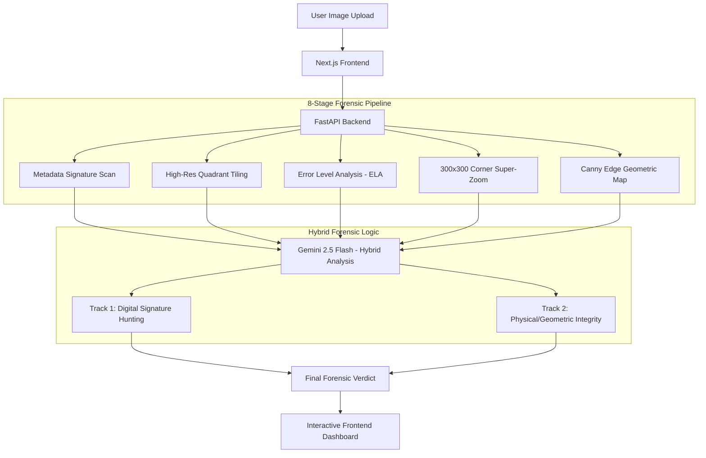

# 🕵️ AI Image Forensics App

A professional-grade, multi-layered forensic suite designed to detect AI-generated, manipulated, and enhanced imagery. The application employs a "Skeptical Forensic Analyst" methodology, cross-referencing visual artifacts and digital signatures across an 8-stage automated inspection pipeline.

## 🚀 Key Features
- **Hybrid Forensic Logic (HFL)**: Dual-track reasoning system (Signatures vs. Physical Integrity).
- **8-Stage Neural Pipeline**: Automated extraction of ELA, Edge Maps, and high-resolutions tiles.
- **Interactive Forensic Slider**: Real-time side-by-side comparison of original source vs. forensic maps.
- **AI Quota Guard**: Visual pulse countdown to manage API rate limits gracefully.
- **Forensic PDF Export**: Professionally formatted investigation reports for legal/official records.

## 🛠 Tech Stack

### Frontend
- **Framework**: [Next.js 16 (App Router)](https://nextjs.org/)
- **Styling**: [Tailwind CSS 4](https://tailwindcss.com/)
- **Icons**: [Lucide React](https://lucide.dev/)
- **Components**: Framer Motion (for micro-animations).

### Backend
- **Engine**: [FastAPI](https://fastapi.tiangolo.com/) (Python 3.12+)
- **Computer Vision**: OpenCV (Canny Edge), Pillow (ELA & Tiling).
- **Communication**: [Uvicorn](https://www.uvicorn.org/) ASGI server.

### AI Core
- **Model**: [Google Gemini 2.5 Flash](https://aistudio.google.com/) (Multimodal).
- **SDK**: `google-genai` (Vercel-AI compatible).

## 📊 System Architecture

The following diagram illustrates the data flow from the moment an image is uploaded until the final forensic verdict is delivered.

## 🔍 Forensic Investigation Pipeline

1.  **Metadata Scan**: Scans file headers for hard-coded AI monograms (Gemini, Adobe Firefly, etc.).
2.  **Quadrants (1-4)**: Images are tiled to prevent detail loss during AI downscaling, ensuring texture analysis is accurate.
3.  **ELA (Error Level Analysis)**: Highlights areas with inconsistent compression levels, a key indicator of manipulation.
4.  **Corner Zoom**: A high-resolution crop of the bottom-right corner to hunt for subtle digital watermarks.
5.  **Canny Edge Analysis**: Extracts geometric outlines to expose hidden AI watermarks and structural failures.

## 🖼️ GUI Showcase

### Dashboard Overview

*The primary workspace where the 'Neural Investigation' begins.*

### Forensic Comparison Slider

*Interactive tool for comparing the original source with the generated ELA map.*

### Neural Anomaly Detection

*Detailed view of a triggered forensic hit pinpointed within a specific quadrant.*

## ⚙️ Getting Started

### Prerequisites
- Python 3.12+
- Node.js 18+
- [Gemini API Key](https://aistudio.google.com/)

### Backend Setup
1. `cd backend`
2. `python -m venv venv && source venv/bin/activate`
3. `pip install -r requirements.txt`
4. Create `.env` using `.env.example`.
5. `uvicorn main:app --reload`

### Frontend Setup
1. `cd frontend`
2. `npm install`
3. Create `.env.local` using `.env.local.example`.
4. `npm run dev`

## ⚖️ License
Distributed under the MIT License. See `LICENSE` for more information.
