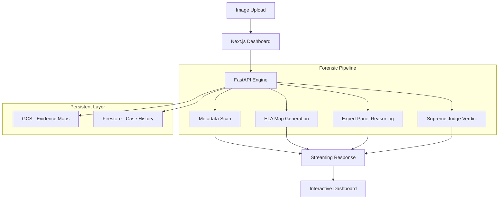
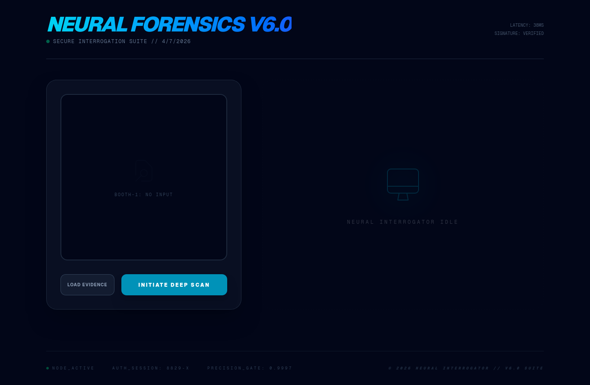
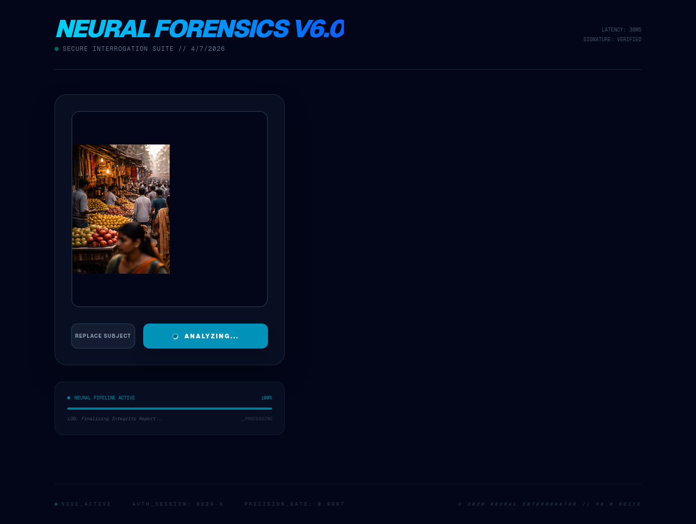
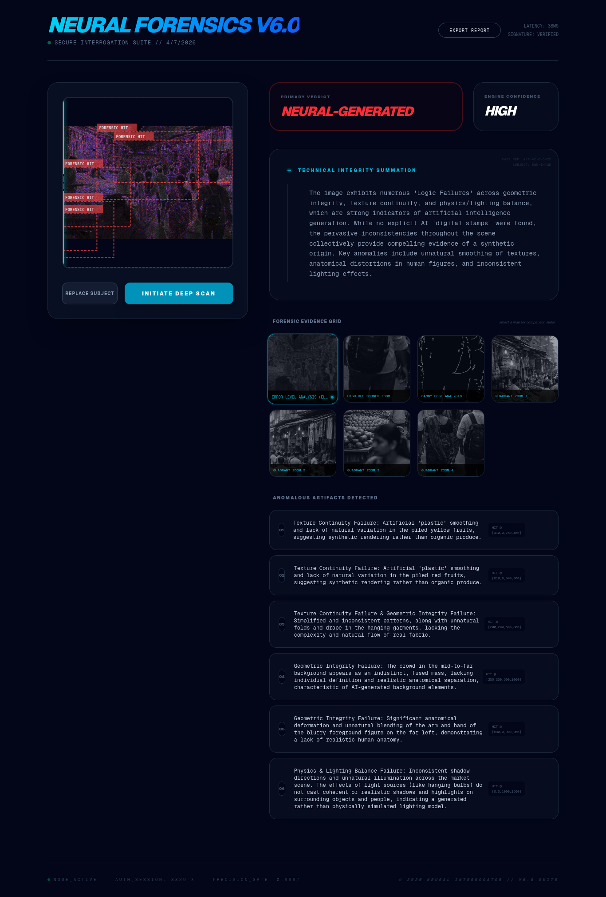

# 🕵️ NEURAL FORENSICS V6.0

A premium, agentic AI forensic suite designed to interrogate digital imagery for signs of manipulation, generation, and enhancement. Utilizing an **8-stage automated inspection pipeline** and a **dual-track reasoning system**, the suite provides high-confidence verdicts backed by visual evidence and a transparent reasoning chain.

---

## 🚀 Key Features

- **🧠 Agentic Reasoning Chain**: Watch the "Neural Interrogator" think in real-time. The system streams its internal logic, from initial metadata scans to the final supreme verdict.
- **🔬 Interactive Forensic Slider**: Compare original source imagery with generated **Error Level Analysis (ELA)** heatmaps using a high-precision side-by-side slider.
- **🎯 Precision Artifact Tagging**: Automatically detects and frames "Forensic Hits" (anomalies) with normalized bounding boxes and detailed artifact descriptions.
- **🔍 Deep Inspection Tools**: Integrated zoom-to-artifact functionality allows investigators to scrutinize microscopic structural failures.
- **📄 Forensic PDF Export**: Generate professional, legally-ready investigation reports containing verdicts, confidence levels, and evidence catalogs.
- **📦 Intelligence Archive**: Export full case data as a `.zip` archive, including JSON technical reports and high-resolution evidence maps.

---

## 🛠 Tech Stack

### Frontend (Intelligence Dashboard)
- **Framework**: [Next.js 16 (App Router)](https://nextjs.org/)
- **Styling**: [Tailwind CSS 4](https://tailwindcss.com/) (Atomic Design System)
- **Visuals**: Framer Motion (State-aware micro-animations)
- **Reporting**: `html2pdf.js` & `JSZip` for secure data export.

### Backend (Forensic Engine)
- **Core**: [FastAPI](https://fastapi.tiangolo.com/) (Python 3.12+)
- **CV Pipeline**: OpenCV (Canny Edge), Pillow (ELA & Tiling).
- **Storage**: Google Cloud Storage (Evidence Hosting) & Firestore (Case Management).

### AI Core (Neural Logic)
- **Models**: [Google Gemini 2.0/2.5 Flash](https://aistudio.google.com/)
- **Paradigm**: Agentic Multi-Step Reasoning (Expert Panel -> Supreme Judge).

---

## 📊 System Architecture

The following diagram illustrates the agentic data flow within the V6.0 pipeline.

---

## 🔍 Investigation Pipeline

1.  **Metadata Interrogation**: Scans file headers for known AI signatures (Gemini, DALL-E, etc.).
2.  **Error Level Analysis (ELA)**: Identifies inconsistencies in pixel compression levels.
3.  **Neural Expert Panel**: Three virtual specialists (Geometry, Pixel Integrity, Semantic Plausibility) analyze the evidence.
4.  **Supreme Verdict**: A consolidated ruling is issued with a confidence score and detailed artifact locations.

---

## 🖼️ GUI Showcase

### Dashboard Overview

*The primary workspace where the 'Neural Investigation' begins.*

### Forensic Comparison Slider

*Interactive tool for comparing the original source with the generated ELA map.*

### Neural Anomaly Detection

*Detailed view of a triggered forensic hit pinpointed within a specific quadrant.*

---

## ⚙️ Getting Started

### Prerequisites
- Python 3.12+
- Node.js 18+
- [Google Cloud Project](https://console.cloud.google.com/) (for GCS/Firestore)
- [Gemini API Key](https://aistudio.google.com/)

### Backend Setup
1. `cd backend`
2. `pip install -r requirements.txt`
3. Configure `.env` with `GEMINI_API_KEY` and `GOOGLE_CLOUD_PROJECT`.
4. `uvicorn main:app --reload`

### Frontend Setup
1. `cd frontend`
2. `npm install`
3. Configure `.env.local` with `NEXT_PUBLIC_API_URL`.
4. `npm run dev`

---

## ⚖️ License
Distributed under the MIT License. See `LICENSE` for more information.

