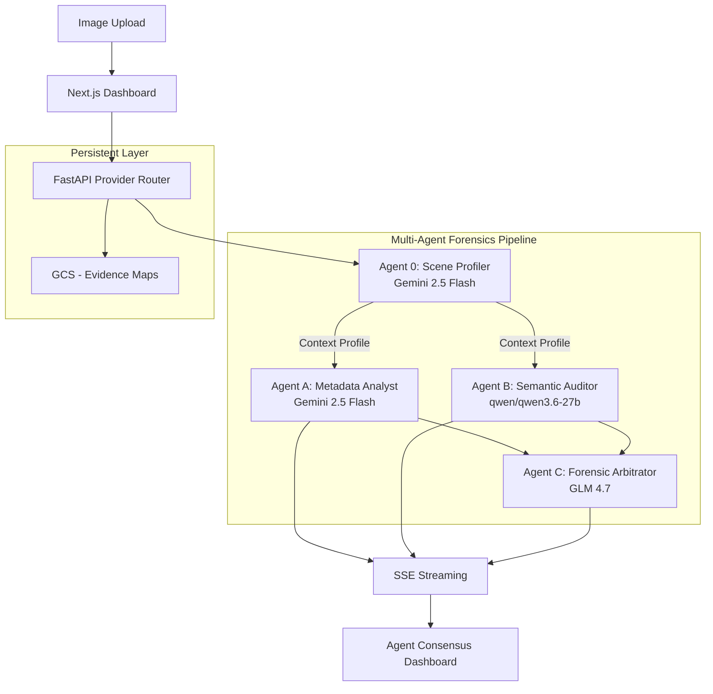
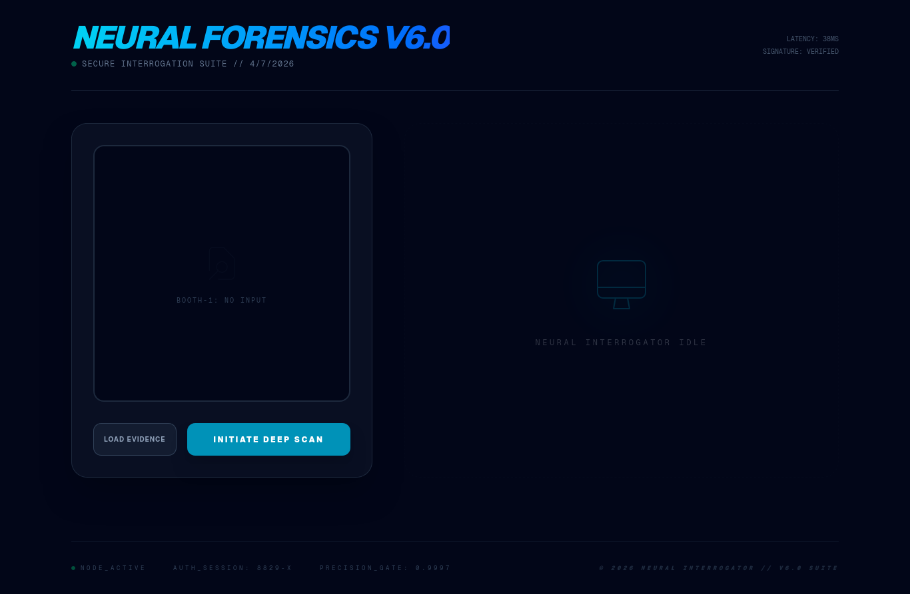
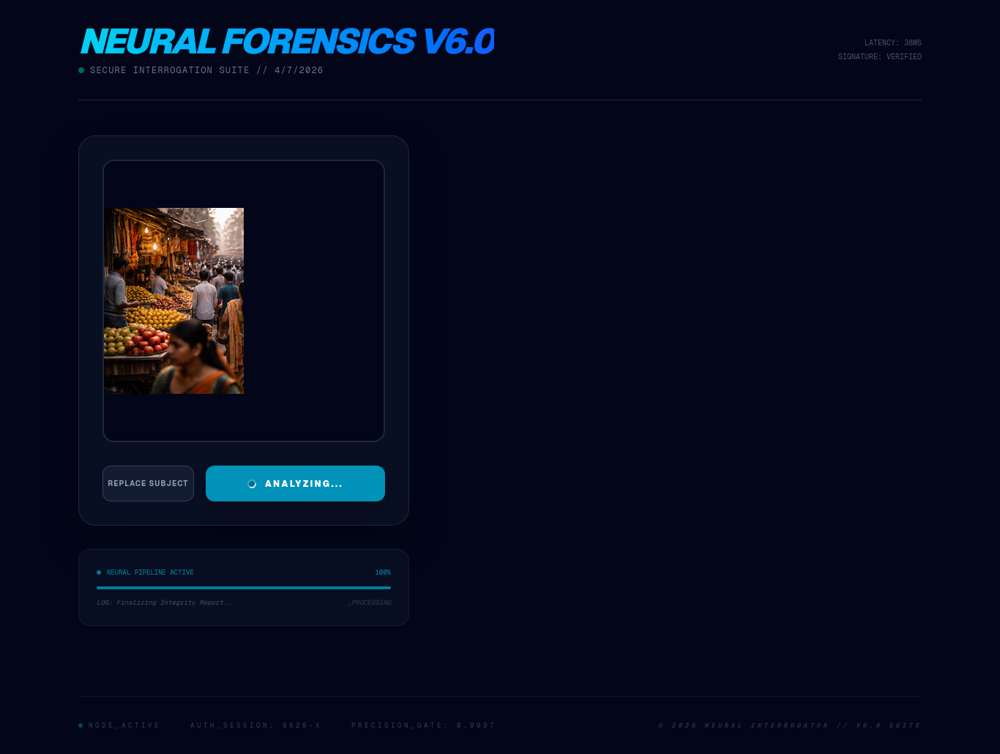
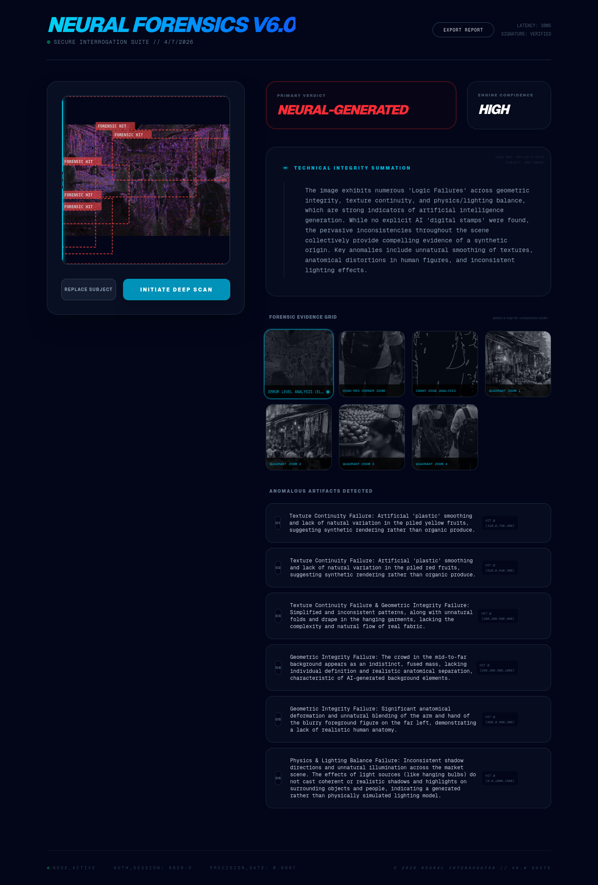

# 🕵️ NEURAL FORENSICS V7.0

A premium, agentic AI forensic suite designed to interrogate digital imagery for signs of manipulation, generation, and enhancement. Utilizing a **context-aware, multi-agent reasoning pipeline**, the suite provides high-confidence verdicts backed by visual evidence and a transparent reasoning chain.

---

## 🚀 Key Features

- **🧠 Agentic Reasoning Chain**: Watch the "Neural Interrogator" think in real-time. The system streams its internal logic, from initial metadata scans to the final supreme verdict.
- **🌐 Context-Aware Pre-Processing**: Before forensic analysis begins, an Agent 0 "Scene Profiler" identifies the image's medium, subject, and style — sharply reducing false positives from agents misreading normal stylistic traits (brush strokes, flat vector fills) as manipulation artifacts.
- **🔬 Interactive Forensic Slider**: Compare original source imagery with generated **Error Level Analysis (ELA)** heatmaps using a high-precision side-by-side slider.
- **🎯 Precision Artifact Tagging**: Automatically detects and frames "Forensic Hits" (anomalies) with normalized bounding boxes and detailed artifact descriptions.
- **🔍 Deep Inspection Tools**: Integrated zoom-to-artifact functionality allows investigators to scrutinize microscopic structural failures.
- **📄 Forensic PDF Export**: Generate professional, legally-ready investigation reports containing verdicts, confidence levels, and evidence catalogs.
- **📦 Intelligence Archive**: Export full case data as a `.zip` archive, including JSON technical reports and high-resolution evidence maps.

---

## 🛠 Tech Stack

### Frontend (Intelligence Dashboard)
- **Framework**: [Next.js 16 (App Router)](https://nextjs.org/)
- **Styling**: [Tailwind CSS 4](https://tailwindcss.com/) (Atomic Design System)
- **Visuals**: Framer Motion (State-aware micro-animations)
- **Reporting**: `html2pdf.js` & `JSZip` for secure data export.

### Backend (Forensic Engine)
- **Core**: [FastAPI](https://fastapi.tiangolo.com/) (Python 3.12+)
- **CV Pipeline**: OpenCV (Canny Edge), Pillow (ELA & Tiling).
- **Storage**: Google Cloud Storage (Evidence Hosting).

### AI Core (Multi-Agent Forensics)
| Agent Role | Model Provider | Key Responsibilities |
| :--- | :--- | :--- |
| **Agent 0: Scene Profiler** | Google Gemini 2.5 Flash | Context extraction — medium, subject, lighting, visible text — passed to all downstream agents. |
| **Agent A: Metadata & Compression** | Google Gemini 2.5 Flash | ELA heatmaps, compression anomalies, file signatures. |
| **Agent B: Semantic Auditor** | Groq (qwen/qwen3.6-27b) | Lighting consistency, geometry, semantic plausibility. *(Single-image analysis due to API limits)* |
| **Agent C: Forensic Arbitrator** | Cerebras (GLM 4.7) | Verdict synthesis, conflict resolution, calibration. |

---

## 📊 System Architecture

The following diagram illustrates the agentic data flow within the V7.0 multi-agent pipeline.

```mermaid
graph TD
    A[Image Upload] --> B[Next.js Dashboard]
    B --> C[FastAPI Provider Router]
    C --> D0[Agent 0: Scene Profiler <br> Gemini 2.5 Flash]
    
    subgraph "Multi-Agent Forensics Pipeline"
        D0 -->|Context Profile| D1[Agent A: Metadata Analyst <br> Gemini 2.5 Flash]
        D0 -->|Context Profile| D2[Agent B: Semantic Auditor <br> qwen/qwen3.6-27b]
        D1 --> D3[Agent C: Forensic Arbitrator <br> GLM 4.7]
        D2 --> D3
    end
    
    D1 & D2 & D3 --> E[SSE Streaming]
    E --> F[Agent Consensus Dashboard]
    
    subgraph "Persistent Layer"
        C --> G[GCS - Evidence Maps]
    end
```

---

## 🔍 Investigation Pipeline

1.  **CV Pre-Processing**: Generates ELA heatmaps and edge-detection maps from the source image.
2.  **Scene Profiling**: Agent 0 extracts neutral visual context (medium, subject, style) to calibrate downstream analysis.
3.  **Parallel Specialist Analysis**: Agent A (compression/metadata) and Agent B (semantic/geometric) analyze the evidence independently, each informed by the scene profile.
4.  **Arbitration**: Agent C resolves conflicts between the two reports and issues a confidence-scored verdict — automatically capped to "uncertain" if either specialist agent failed, preventing false-confidence results.

---

## 📝 Engineering Notes & Known Limitations

### Architecture overview

Neural Forensics runs a multi-agent pipeline across three independent LLM providers, deliberately chosen for redundancy rather than convenience:

- **Agent 0 (Scene Profiler)** — Gemini 2.5 Flash. Runs first, before any forensic analysis. Produces a neutral context profile (medium, subject, lighting, visible text) that gets injected into every downstream agent's prompt, reducing false positives caused by agents mistaking normal medium-specific characteristics (brush strokes, flat vector fills, stylized rendering) for manipulation artifacts.
- **Agent A (Compression Analyst)** — Gemini 2.5 Flash primary, with a Groq fallback.
- **Agent B (Semantic/Geometric Auditor)** — Groq (`qwen/qwen3.6-27b`) primary, with a Gemini fallback.
- **Agent C (Arbitrator)** — Cerebras, resolves conflicts between Agent A and B and issues the final verdict.

Using different providers for the two primary specialist agents means a single provider outage or model regression doesn't take down the whole pipeline — but it also means the system inherits each provider's individual constraints, some of which required real architectural decisions rather than simple bug fixes.

### Known limitation: Groq's vision model is preview-status

As of this writing, `qwen/qwen3.6-27b` is the only vision-capable model Groq offers — confirmed directly against Groq's live `/v1/models` endpoint, cross-referenced with their production/preview status documentation. There is currently no production-tier vision model available on Groq. This is a deliberate, accepted tradeoff: the alternative (OpenAI's gpt-oss models, which are production-status on Groq) doesn't support image input at all, so it isn't a viable substitute for a vision agent regardless of its structured-output reliability.

This is documented directly in `agent_b.py` so it isn't mistaken for an oversight, and it's the reason Agent B carries more defensive handling (retry-with-validation-error, explicit token budgeting) than a model with native structured-output guarantees would need.

### Known limitation: Groq free-tier rate limits and forensic image fidelity

Groq's free tier enforces an 8,000 tokens-per-minute (TPM) budget per request, calculated as `prompt_tokens + max_tokens`. For a vision agent receiving multiple images (original + derived maps) per call, this creates a hard ceiling on how much visual detail can be sent per request — one that a naive fix (blanket image downscaling) would have silently undermined the tool's actual purpose.

The two specialist agents needed different solutions, because they rely on different kinds of visual signal:

- **Agent B (Semantic Auditor)** analyzes macro-level structural features — lighting consistency, shadow direction, anatomical plausibility, perspective. Due to strict provider TPM rate limits (8000 max), Agent B on Groq operates in a transparent **single-image analysis mode**, receiving only the original image and inferring texture/boundary anomalies directly from RGB data without a synthetic edge map.
- **Agent A's Groq fallback** analyzes Error Level Analysis (ELA) maps, which depend entirely on pixel-level JPEG compression noise. Downscaling an ELA map destroys the exact signal the agent is meant to detect. Rather than degrade its accuracy silently, this path performs a pre-flight token estimate and aborts the fallback attempt outright on oversized images, returning an explicit "image too large for Groq fallback — full-resolution analysis required" finding instead of a raw API error.

The result: Agent B stays reliable at any image size, Agent A's fallback stays honest about its limits, and neither path silently sacrifices forensic accuracy to fit a rate limit.

### Safeguard: confidence capping under degraded pipeline state

Early testing surfaced a subtler problem than any individual API failure: when one specialist agent failed outright, the Arbitrator would sometimes trust the surviving agent's report completely and still issue a high-confidence verdict — a 95% "Authentic" result built on half the intended evidence, with the failure buried in the reasoning text rather than reflected in the headline.

The Arbitrator now enforces a hard rule, in code rather than prompt instruction alone: if either specialist agent failed to produce a valid report, the final verdict is capped at "uncertain" and confidence is capped below the frontend's visual-confidence threshold — unless the Arbitrator's own confidence is very high *and* its reasoning explicitly acknowledges and justifies the failure. This is covered by dedicated tests (`test_arbitrator_caps_confidence_on_degraded_input`, `test_arbitrator_allows_override_with_acknowledgment`) so the safeguard can't silently regress in a future refactor.

### Debugging notes: root-causing a recurring JSON failure

One bug — Agent B intermittently failing to return valid JSON — took four rounds of investigation to fully resolve, each ruling out a plausible-but-wrong theory before landing on the real cause:

1. **Markdown fencing** (initial theory) — disproven once raw Groq responses showed an empty `failed_generation` field; fenced content would have appeared there if this were the cause.
2. **Token truncation** — closer, but incomplete; confirmed only after raising `max_tokens` explicitly and observing the actual failure mode change.
3. **Strict schema mode support** — attempted switch to `json_schema` strict mode, reverted after Groq's own API error confirmed `qwen/qwen3.6-27b` doesn't support it; only two Groq models do, and neither has vision support.
4. **Per-request TPM rate limiting** — the true root cause, confirmed via raw `413` error output tying `prompt_tokens + max_tokens` directly to Groq's 8,000 TPM ceiling.

The resolution — a shared `call_llm_with_json_validation` helper handling per-attempt timeouts, schema validation, and single-retry-with-error-injection, applied consistently across all four LLM call sites (Agent A primary/fallback, Agent B primary/fallback) — replaced four independently-drifting implementations with one tested, consistent pattern.

### Test coverage

- `test_agent_0.py` — Scene Profiler success and fallback-on-failure paths.
- `test_llm_utils.py` — shared helper: successful generation, validation-failure-then-retry, and total-failure fallback behavior, across both Groq and Gemini.
- `test_size_limits.py` — Agent B's dynamic resizer correctly fits the token budget without altering already-small images; Agent A's fallback correctly aborts on oversized images without making a wasted API call.
- `test_agent_c.py` — Arbitrator confidence-capping under degraded pipeline state, including the override path when failure is explicitly acknowledged at high confidence.

---

## 🖼️ GUI Showcase

### Dashboard Overview

*The primary workspace where the 'Neural Investigation' begins.*

### Forensic Comparison Slider

*Interactive tool for comparing the original source with the generated ELA map.*

### Neural Anomaly Detection

*Detailed view of a triggered forensic hit pinpointed within a specific quadrant.*

---

## ⚙️ Getting Started

### Prerequisites
- Python 3.12+
- Node.js 18+
- [Google Cloud Project](https://console.cloud.google.com/) (for GCS)
- [Gemini API Key](https://aistudio.google.com/)
- [Groq API Key](https://console.groq.com)
- [Cerebras API Key](https://cloud.cerebras.ai)

### Backend Setup
1. `cd backend`
2. `pip install -r requirements.txt`
3. Configure `.env` with `GEMINI_API_KEY`, `GROQ_API_KEY`, `CEREBRAS_API_KEY`, and `GOOGLE_CLOUD_PROJECT`.
4. Start the backend (`uvicorn main:app --reload`)

> **Note on API Quotas (Mock Mode):**
> Because this pipeline chains 4 LLM calls per image, you can burn through free-tier quotas (like Groq's 200k TPD limit) quickly during local UI development. 
> To bypass actual API calls and use realistic canned JSON responses, set `USE_MOCK_LLM=true` in `backend/.env`. You can also set `MOCK_SCENARIO=anomalous` or `MOCK_SCENARIO=retry_success` to test specific failure paths without hitting the network. Mock Mode will automatically refuse to start if deployed to a production environment like a Hugging Face Space.

### Frontend Setup
1. `cd frontend`
2. `npm install`
3. Configure `.env.local` with `NEXT_PUBLIC_HF_API_URL`.
4. `npm run dev`

---

## 🌐 Deployment

Neural Forensics V7.0 is configured for decoupled cloud deployment:
- **Backend (Hugging Face Spaces)**: Utilizes a dedicated `Dockerfile` (Docker SDK) to spin up the Python 3.12 environment. Requires `GOOGLE_APPLICATION_CREDENTIALS` (JSON), plus the `GEMINI`, `GROQ`, and `CEREBRAS` API keys mapped as Secrets.
- **Frontend (Vercel)**: Next.js frontend deployed seamlessly via Vercel. Connects directly to the backend via the `NEXT_PUBLIC_HF_API_URL` environment variable to ensure real-time multi-agent reasoning streams aren't buffered or timed out by serverless proxies.

---

## ⚖️ License
Distributed under the MIT License. See `LICENSE` for more information.
